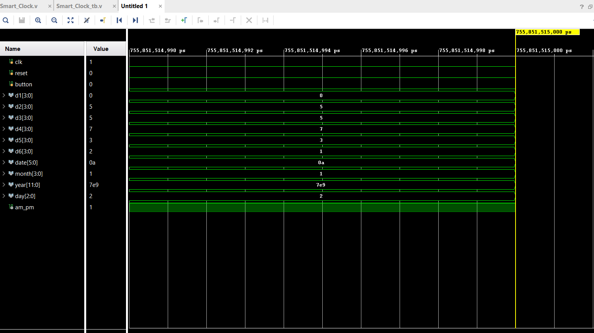
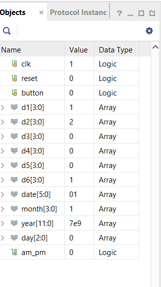
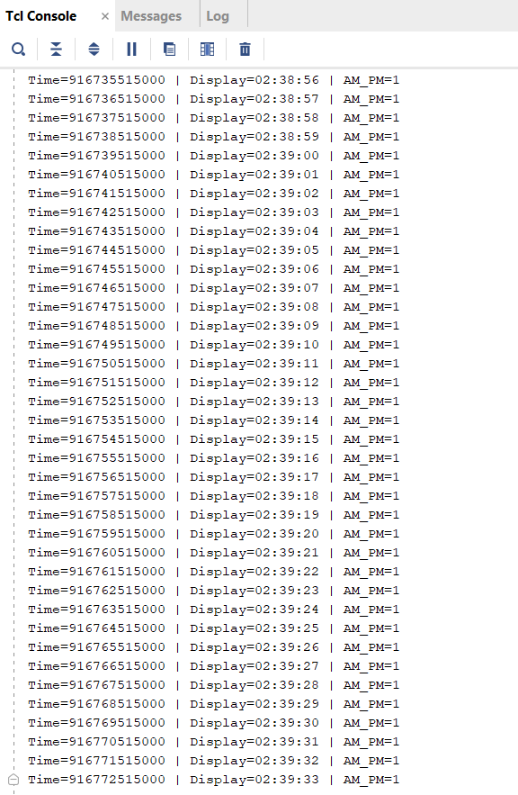
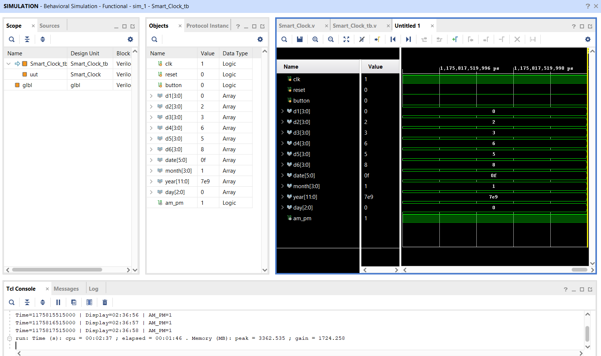

# Smart Digital Clock with Calendar (Verilog)

## Abstract  
The project involves designing a digital clock using Verilog HDL that not only displays time but also the date. This digital clock will update time every second and handle calendar-related activities, including updating the month and year.

## Table of Contents  
- Introduction  
- Features  
- Working  
- Outputs  
- Conclusion  
- Future Scope  

## Introduction  
Digital clocks are used for embedded systems. This project involves designing a smart digital clock using Verilog HDL that keeps a track of time as well as date.

This project involves understanding basic concepts used for designing digital circuits, which include counters and clock dividers.

## Features
- Display of time in **HH:MM:SS (12-hour format)**
- Display of date in **DD-MM-YY format**
- **AM/PM** time conversion
- **Leap year** detection
- **Automatic update** of date, month, and year
- **Tracking** of days in **0-6 format**
- Switching of modes by a button press:
  - Mode 0: Time display
  - Mode 1: Date display
  - Mode 2: Display of days
- Display of time in **6 display digits (d1, d6)**

## Working

### 1. Clock Divider
- Divide the clock and derive a **1-second signal (`clk_1s`)** for time updates

### 2. Time Storage
- Time is stored in the following manner:
  h1 h2 - Hours
  m1 m2 - Minutes
  s1 s2 - Seconds

### 3. Time Counting Logic
- Seconds increment every second
- After 59 seconds, minutes increment
- After 59 minutes, hours increment

### 4. 12-Hour Format Logic
- Clock is in 12-hour format
- Time transitions:
  - 11 -> 12 -> AM/PM changes
  - 12 -> 01 -> New cycle starts

### 5. Date Logic
- Date changes at midnight
- Month changes when maximum days are reached
- Year changes after December

### 6. Leap Year Logic
(year % 4 == 0 && year % 100 != 0) || (year % 400 == 0)
- February has 29 days in a leap year and 28 in non-leap years

### 7. Mode-Based Display Logic
#### Mode 0 - Time Display
#### Mode 1 - Date Display
#### Mode 2 - Day Display

## Outputs
- Time increases correctly every second  

## Conclusion
This project has successfully demonstrated the design of a digital clock using Verilog. This digital clock is functioning correctly and is able to display the date and time. It is able to account for leap years. This project is designed considering basic concepts of digital logic.

## Future Scope
- Implementation on **FPGA board**
- Adding **alarm feature**
- Adding manual **time setting using buttons**
